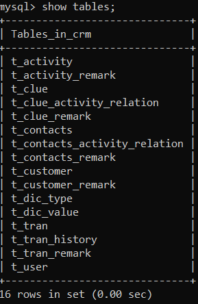
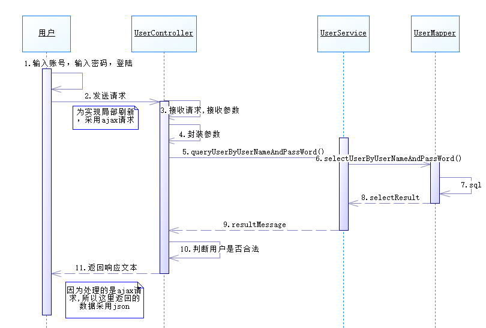
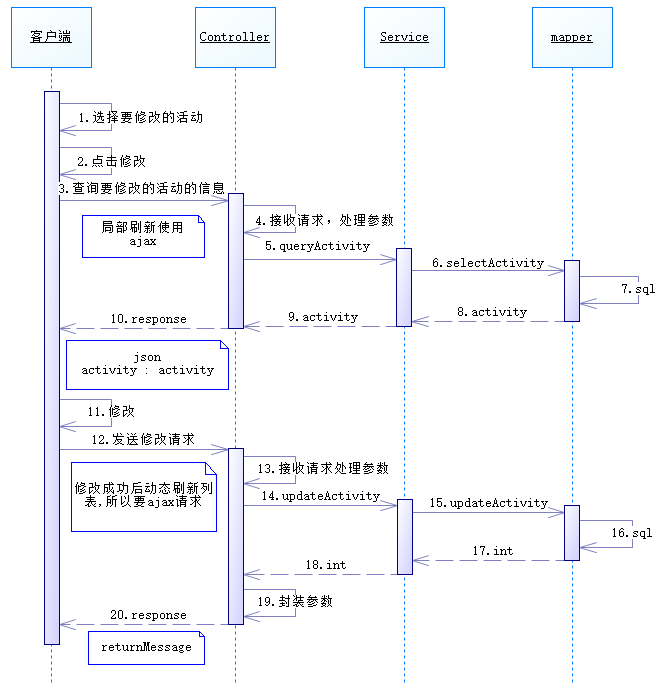
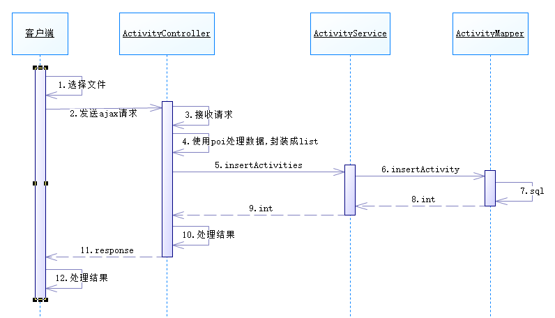
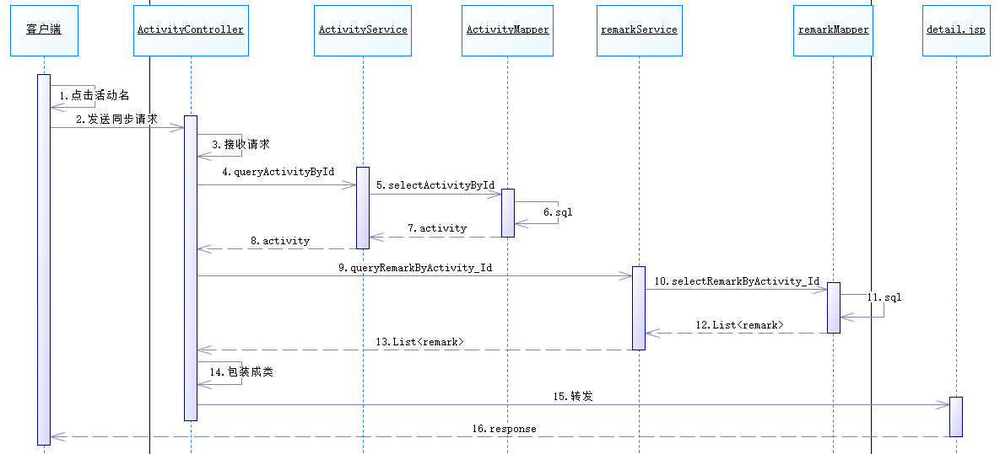

# CRM项目
## 工作计划
```
每日任务:
第一天: 需求分析与技术架构  
第二天: 物理模型设计与搭建开发环境
第三天: 根据原型html编辑首页相关功能
第四天: 编写user相关内容和用户登录功能
第五天: 实现市场活动的创建活动的相关代码
第六天: 实现市场活动的分页查询的相关代码
第七天: 实现市场活动的删除,修改
第八天: 实现市场活动的导出
第九天: 实现市场活动的导入
第十天: 市场活动明细
第十一天: 备注curd
第十二天: 数据字典创建,dic_value curd
第十三天: 线索curd
第十四天: 线索的详情,备注,线索联系的活动
第十五天: 线索转换为客户,联系人,交易
第十六、十七天: 客户版块和客户的详细页面功能
第十八天: 联系人模块
第十九天: 交易功能curd
第二十天: 交易功能的详情，交易历史表,漏洞图
``` 
## 项目核心业务介绍
1. 作用: CRM为改善企业与客户之间关系的提供了一种新型管理机制，
企业可以规划市场营销活动、增加销售线索、规范客户联系人信息、
对不同阶段的交易进行有效区分和统计、
妥善安排售后回访、为决策提供支撑等，优化各业务环节，
减少各环节客户流失，和公司成本。
2. 业务流程对应的相应功能模块
- 市场活动:市场部人员策划组织活动 
- 线索:市场部所统计的数据,销售部进行逐一销售
- 客户:将线索中购买意愿强的公司归为客户
- 联系人: 客户中的公司的联系人
- 交易:已经促成的交易，不代表交易已经完成，分为九个阶段
- 售后回访:客记录售后回访信息，包括客户满意度调查、问题解决情况等。及时响应客户投诉和问题，提高客户满意度
- 统计图:提供各种报表和分析功能，体现各阶段的数据变化，帮助管理层做出决策
- 安全和权限:确保敏感数据的安全性，设置不同用户角色和权限，保护数据的访问和修改
## 技术架构
视图层:展示数据，与用户交互 html,css,javaScript,jQuery,ajax,jsp
控制层:接收请求，接收参数，封装参数，调用业务层 springMVC
业务逻辑层:处理业务逻辑
持久层:操作数据库 mybatis
整合层:实例化对象，处理对象间的关联关系 spring(ioc,aop)
## 物理模型设计

字段为了使用方便都采用了varchar,起别名的时候不需要转换类型可以直接使用实体类封装,每个表对应一个实体类，关系表主要要来联合查询所以不设置实体类，其中字典表保存所有下拉列表的数据，因为下拉列表数据的字段是相同的放一起方便管理


## 搭建开发环境
- jdk 17.0.5
- tomcat 10.1.6
- spring 6.0.11
- mysql 8.0.30
- maven 3.6.1  
- pom.xml 
```xml
<?xml version="1.0" encoding="UTF-8"?>

<project xmlns="http://maven.apache.org/POM/4.0.0" xmlns:xsi="http://www.w3.org/2001/XMLSchema-instance"
         xsi:schemaLocation="http://maven.apache.org/POM/4.0.0 http://maven.apache.org/xsd/maven-4.0.0.xsd">
  <modelVersion>4.0.0</modelVersion>

  <groupId>com.bjpowernode</groupId>
  <artifactId>springmvc_ssm</artifactId>
  <version>1.0-SNAPSHOT</version>
  <packaging>war</packaging>

  <!-- 集中定义依赖版本号 -->

  <properties>
    <project.build.sourceEncoding>UTF-8</project.build.sourceEncoding>
    <maven.compiler.source>1.7</maven.compiler.source>
    <maven.compiler.target>1.7</maven.compiler.target>
    <junit.version>4.12</junit.version>
    <spring.version>6.0.11</spring.version>
    <mybatis.version>3.5.13</mybatis.version>
    <mybatis.spring.version>3.0.2</mybatis.spring.version>
    <mybatis.paginator.version>1.2.17</mybatis.paginator.version>
    <mysql.version>8.0.33</mysql.version>
    <druid.version>1.2.16</druid.version>
    <pagehelper.version>5.3.2</pagehelper.version>
    <jstl.version>3.0.1</jstl.version>
    <jstl-api.version>3.0.0</jstl-api.version>
    <servlet-api.version>6.0.0</servlet-api.version>
    <jsp-api.version>3.1.1</jsp-api.version>
    <jackson.version>2.15.1</jackson.version>
  </properties>


  <dependencies>
    <!-- spring -->
    <dependency>
      <groupId>org.springframework</groupId>
      <artifactId>spring-context</artifactId>
      <version>${spring.version}</version>
    </dependency>
    <dependency>
      <groupId>org.springframework</groupId>
      <artifactId>spring-beans</artifactId>
      <version>${spring.version}</version>
    </dependency>
    <dependency>
      <groupId>org.springframework</groupId>
      <artifactId>spring-webmvc</artifactId>
      <version>${spring.version}</version>
    </dependency>
    <dependency>
      <groupId>org.springframework</groupId>
      <artifactId>spring-jdbc</artifactId>
      <version>${spring.version}</version>
    </dependency>
    <dependency>
      <groupId>org.springframework</groupId>
      <artifactId>spring-aspects</artifactId>
      <version>${spring.version}</version>
    </dependency>
    <dependency>
      <groupId>org.springframework</groupId>
      <artifactId>spring-jms</artifactId>
      <version>${spring.version}</version>
    </dependency>
    <dependency>
      <groupId>org.springframework</groupId>
      <artifactId>spring-context-support</artifactId>
      <version>${spring.version}</version>
    </dependency>
    <dependency>
      <groupId>org.springframework</groupId>
      <artifactId>spring-test</artifactId>
      <version>${spring.version}</version>
    </dependency>
    <!-- Mybatis -->
    <dependency>
      <groupId>org.mybatis</groupId>
      <artifactId>mybatis</artifactId>
      <version>${mybatis.version}</version>
    </dependency>
    <dependency>
      <groupId>org.mybatis</groupId>
      <artifactId>mybatis-spring</artifactId>
      <version>${mybatis.spring.version}</version>
    </dependency>
    <dependency>
      <groupId>com.github.miemiedev</groupId>
      <artifactId>mybatis-paginator</artifactId>
      <version>${mybatis.paginator.version}</version>
    </dependency>
    <dependency>
      <groupId>com.github.pagehelper</groupId>
      <artifactId>pagehelper</artifactId>
      <version>${pagehelper.version}</version>
    </dependency>
    <!-- MySql -->
    <dependency>
      <groupId>mysql</groupId>
      <artifactId>mysql-connector-java</artifactId>
      <version>${mysql.version}</version>
    </dependency>
    <!-- 连接池 -->
    <dependency>
      <groupId>com.alibaba</groupId>
      <artifactId>druid</artifactId>
      <version>${druid.version}</version>
    </dependency>

    <!-- junit -->
    <dependency>
      <groupId>junit</groupId>
      <artifactId>junit</artifactId>
      <version>${junit.version}</version>
      <scope>com.bjpowernode.test</scope>
    </dependency>


    <!-- JSP相关 -->
    <dependency>
      <groupId>org.glassfish.web</groupId>
      <artifactId>jakarta.servlet.jsp.jstl</artifactId>
      <version>${jstl.version}</version>
    </dependency>
    <dependency>
      <groupId>jakarta.servlet.jsp.jstl</groupId>
      <artifactId>jakarta.servlet.jsp.jstl-api</artifactId>
      <version>${jstl-api.version}</version>
    </dependency>
    <dependency>
      <groupId>jakarta.servlet</groupId>
      <artifactId>jakarta.servlet-api</artifactId>
      <version>${servlet-api.version}</version>
      <scope>provided</scope>
    </dependency>
    <!-- https://mvnrepository.com/artifact/jakarta.servlet.jsp/jakarta.servlet.jsp-api -->
    <dependency>
      <groupId>jakarta.servlet.jsp</groupId>
      <artifactId>jakarta.servlet.jsp-api</artifactId>
      <version>${jsp-api.version}</version>
      <scope>provided</scope>
    </dependency>

    <!-- Jackson Json处理工具包 -->
    <dependency>
      <groupId>com.fasterxml.jackson.core</groupId>
      <artifactId>jackson-databind</artifactId>
      <version>${jackson.version}</version>
    </dependency>
    <dependency>
      <groupId>org.json</groupId>
      <artifactId>json</artifactId>
      <version>20230618</version>
    </dependency>

    <!--    文件异步上传使用的依赖-->
    <dependency>
      <groupId>commons-io</groupId>
      <artifactId>commons-io</artifactId>
      <version>2.4</version>
    </dependency>
    <dependency>
      <groupId>commons-fileupload</groupId>
      <artifactId>commons-fileupload</artifactId>
      <version>1.3.1</version>
    </dependency>
    <!--日志-->
    <dependency>
      <groupId>org.apache.logging.log4j</groupId>
      <artifactId>log4j-core</artifactId>
      <version>2.19.0</version>
    </dependency>
    <dependency>
      <groupId>org.apache.logging.log4j</groupId>
      <artifactId>log4j-slf4j2-impl</artifactId>
      <version>2.19.0</version>
    </dependency>
  </dependencies>


  <build>
    <finalName>springmvc_ssm</finalName>
    <pluginManagement><!-- lock down plugins versions to avoid using Maven defaults (may be moved to parent pom) -->
      <plugins>
        <plugin>
          <artifactId>maven-clean-plugin</artifactId>
          <version>3.1.0</version>
        </plugin>
        <!-- see http://maven.apache.org/ref/current/maven-core/default-bindings.html#Plugin_bindings_for_war_packaging -->
        <plugin>
          <artifactId>maven-resources-plugin</artifactId>
          <version>3.0.2</version>
        </plugin>
        <plugin>
          <artifactId>maven-compiler-plugin</artifactId>
          <version>3.8.0</version>
        </plugin>
        <plugin>
          <artifactId>maven-surefire-plugin</artifactId>
          <version>2.22.1</version>
        </plugin>
        <plugin>
          <artifactId>maven-war-plugin</artifactId>
          <version>3.2.2</version>
        </plugin>
        <plugin>
          <artifactId>maven-install-plugin</artifactId>
          <version>2.5.2</version>
        </plugin>
        <plugin>
          <artifactId>maven-deploy-plugin</artifactId>
          <version>2.8.2</version>
        </plugin>
      </plugins>
    </pluginManagement>
    <resources>
      <resource>
        <directory>src/main/java</directory>
        <includes>
          <include>**/*.xml</include>
        </includes>
      </resource>
      <resource>
        <directory>src/main/resources</directory>
        <includes>
          <include>**/*.*</include>
        </includes>
      </resource>
    </resources>
  </build>

</project>
```
- mybatis相关配置
```
<?xml version="1.0" encoding="UTF-8" ?>
<!DOCTYPE configuration
        PUBLIC "-//mybatis.org//DTD Config 3.0//EN"
        "http://mybatis.org/dtd/mybatis-3-config.dtd">
<configuration>
    <!--mybatis核心配置不能配置到spring-->
    <settings>
        <setting name="logImpl" value="log4j2"/>
        <setting name="mapUnderscoreToCamelCase" value="true"/>
    </settings>
</configuration>
```
```
<?xml version="1.0" encoding="UTF-8"?>
<beans xmlns="http://www.springframework.org/schema/beans"
       xmlns:xsi="http://www.w3.org/2001/XMLSchema-instance"
       xmlns:context="http://www.springframework.org/schema/context"
       xsi:schemaLocation="http://www.springframework.org/schema/beans http://www.springframework.org/schema/beans/spring-beans.xsd http://www.springframework.org/schema/context https://www.springframework.org/schema/context/spring-context.xsd">
   
    <context:component-scan base-package="com.bjpowernode.crm.mapper"/>

    <context:property-placeholder location="classpath:jdbcData.properties"/>
    <!--数据源-->
    <bean id="druidDataSource" class="com.alibaba.druid.pool.DruidDataSource">
        <property name="driverClassName" value="${jdbc.driver}"/>
        <property name="url" value="${jdbc.url}"/>
        <property name="username" value="${jdbc.user}"/>
        <property name="password" value="${jdbc.password}"/>
    </bean>

    <bean class="org.mybatis.spring.SqlSessionFactoryBean">
        <property name="configLocation" value="classpath:mybatis-config.xml"/>
        <property name="dataSource" ref="druidDataSource"/>
        <property name="typeAliasesPackage" value="com.bjpowernode.crm.pojo"/>
    </bean>

    <bean class="org.mybatis.spring.mapper.MapperScannerConfigurer">
        <property name="basePackage" value="com.bjpowernode.crm.mapper"/>
    </bean>
</beans>
```
- spring - service配置
```
<?xml version="1.0" encoding="UTF-8"?>
<beans xmlns="http://www.springframework.org/schema/beans"
       xmlns:xsi="http://www.w3.org/2001/XMLSchema-instance"
       xmlns:context="http://www.springframework.org/schema/context" xmlns:tx="http://www.springframework.org/schema/tx"
       xsi:schemaLocation="http://www.springframework.org/schema/beans http://www.springframework.org/schema/beans/spring-beans.xsd http://www.springframework.org/schema/context https://www.springframework.org/schema/context/spring-context.xsd http://www.springframework.org/schema/tx http://www.springframework.org/schema/tx/spring-tx.xsd">

    <context:component-scan base-package="com.bjpowernode.crm.mapper"/>
    <bean id="transactionManager" class="org.springframework.jdbc.datasource.DataSourceTransactionManager">
        <property name="dataSource" ref="druidDataSource"/>
    </bean>
    <!--开启事务-->
    <tx:annotation-driven transaction-manager="transactionManager"/>
</beans>
```
- mvc
``` 
<?xml version="1.0" encoding="UTF-8"?>
<beans xmlns="http://www.springframework.org/schema/beans"
       xmlns:xsi="http://www.w3.org/2001/XMLSchema-instance"
       xmlns:context="http://www.springframework.org/schema/context"
       xmlns:mvc="http://www.springframework.org/schema/mvc"
       xsi:schemaLocation="http://www.springframework.org/schema/beans http://www.springframework.org/schema/beans/spring-beans.xsd http://www.springframework.org/schema/context https://www.springframework.org/schema/context/spring-context.xsd http://www.springframework.org/schema/mvc https://www.springframework.org/schema/mvc/spring-mvc.xsd">

    <context:component-scan base-package="com.bjpowernode.crm.service"/>
    <!--视图解析器-->
    <bean class="org.springframework.web.servlet.view.InternalResourceViewResolver">
        <property name="prefix" value="/admin/"/>
        <property name="suffix" value=".jsp"/>
    </bean>
    <!--ajax请求，利用注解设置响应内容采用json格式-->
    <mvc:annotation-driven/>
</beans>
```
- web
```
<?xml version="1.0" encoding="UTF-8"?>
<web-app xmlns="http://xmlns.jcp.org/xml/ns/javaee"
         xmlns:xsi="http://www.w3.org/2001/XMLSchema-instance"
         xsi:schemaLocation="http://xmlns.jcp.org/xml/ns/javaee http://xmlns.jcp.org/xml/ns/javaee/web-app_4_0.xsd"
         version="4.0">
    <welcome-file-list>
        <welcome-file>/</welcome-file>
    </welcome-file-list>
    <servlet>
        <servlet-name>dispatcher</servlet-name>
        <servlet-class>org.springframework.web.servlet.DispatcherServlet</servlet-class>
        <init-param>
            <param-name>contextConfigLocation</param-name>
            <param-value>classpath:springmvc.xml</param-value>
        </init-param>
        <multipart-config>
            <max-file-size>1048576</max-file-size>
        </multipart-config>
    </servlet>
    <servlet-mapping>
        <servlet-name>dispatcher</servlet-name>
        <url-pattern>/</url-pattern>
    </servlet-mapping>
    <!--注册其他两个配置文件-->
    <context-param>
        <param-name>contextConfigLocation</param-name>
        <param-value>classpath:applicationContext-*.xml</param-value>
    </context-param>
    <listener>
        <listener-class>org.springframework.web.context.ContextLoaderListener</listener-class>
    </listener>
</web-app> 
```
## 功能实现
### 登录
用户在登录页面,输入用户名和密码,点击"登录"按钮或者回车,完成用户登录的功能.
- 用户名和密码不能为空
- 用户名或者密码错误,用户已过期,用户状态被锁定,ip受限 都不能登录成功
- 登录成功之后,所有业务页面显示当前用户的名称
- 登录验证
- 实现10天记住密码
- 登录成功之后,跳转到业务主页面
- 登录失败,页面不跳转,提示信息

__时序图__

把对用户账号的判断放在controller，而不是负责处理逻辑的service是因为情况特殊，如果让service处理的话，要传输多一个参数request,这样不仅麻烦而且没办法test
  
**需求:**
1. 添加前端keydown事件
2. 根据上述时序图添加对登录的用户账号判断
3. 使用ajax局部刷新提示信息
4. 使用session来显示当前用户，并通过session来进行登录验证（HandlerInterceptor）
5. 使用cookie保存账号密码
6. 安全退出时删除所有有关的cookie和会话，注意cookie的路径要一致不然删除失败

### 市场活动
#### 创建市场活动
用户在市场活动主页面,点击"创建"按钮,弹出创建市场活动的模态窗口;
用户在创建市场活动的模态窗口填写表单,点击"保存"按钮,完成创建市场活动的功能.
**需求**
- 所有者是动态的(在显示市场活动主页面时，就从数据库中查询出所有用户并且显示在创建的模态窗口中)
- 所有者和名称不能为空
- 如果开始日期和结束日期都不为空,则结束日期不能比开始日期小
- 成本只能为非负整数
- 创建成功之后,关闭模态窗口,刷新市场活动列，显示第一页数据，保持每页显示条数不变
- 创建失败,提示信息创建失败,模态窗口不关闭,市场活动列表也不刷新
- !!!activity与user相关的注意保留对应id,因为用户名有可能相同
__时序图__


####分页查询
**需求**
- 当市场活动主页面加载完成之后,显示所有数据的第一页;
- 在市场活动主页面,显示市场活动列表和记录的总条数
- 默认每页显示条数:10
- 用户在市场活动主页面填写查询条件(like %name%,like %owner%,>=startDate,<=endDate),点击"查询"按钮,显示所有符合条件的数据的第一页，保持每页显示条数不变
- 实现翻页功能.

#### 删除活动列表
**需求**
用户在市场活动主页面,选择要删除的市场活动,点击"删除"按钮,弹出确认窗口;
用户点击"确定"按钮,完成删除市场活动的功能.
- 每次至少删除一条市场活动
- 可以批量删除市场活动
- 删除成功之后,刷新市场活动列表,显示第一页数据,保持每页显示条数不变
- 删除失败,提示信息,列表不刷新

#### 修改活动列表
**需求**
用户在市场活动主页面,选择要修改的市场活动,点击"修改"按钮,弹出修改市场活动的模态窗口;
用户在修改市场活动的模态窗口填写表单,点击"更新"按钮,完成修改市场活动的功能.
- 每次能且只能修改一条市场活动，多条只修改第一条
- 所有者 动态的
- 表单验证(同创建标准一样)
- 修改成功之后,关闭模态窗口,刷新市场活动列表,保持页号和每页显示条数都不变
- 修改失败,提示信息,模态窗口不关闭,列表也不刷新
__时序图__


#### 活动数据导出

用户在市场活动主页面,点击"批量导出"按钮,把所有市场活动生成一个excel文件,弹出文件下载的对话框;
用户选择要保存的目录,完成导出市场活动的功能.
- 导出成功之后,页面不刷新 

用户在市场活动主页面,选择要导出的市场活动,点击"选择导出"按钮,把所有选择的数据生成一个excel文件,弹出文件下载的对话框;
用户选择要保存的目录,完成选择导出市场活动的功能.
*每次至少选择导出一条记录
*导出成功之后,页面不刷新

1. 选择活动 2. 点击 3.根据id去查询 4.通过poi封装成excel文件 5.响应

#### 活动数据导入
用户在市场活动主页面,点击"导入"按钮,弹出导入市场活动的模态窗口;
用户在导入市场活动的模态窗口选择要上传的文件,点击"导入"按钮,完成导入市场活动的功能.
- 只支持.xls
- 文件大小不超过5MB
- 导入成功之后,提示成功导入记录条数,关闭模态窗口,刷新市场活动列表,显示第一页数据,保持每页显示条数不变
- 导入失败,提示信息,模态窗口不关闭,列表也不刷新
* 插入的数据舍弃edit_time, edit_by,这两个字段，因为刚添加默认没被修改过，类似于创建活动一样
* excel仅编辑name, start_date, end_date, cost, description;owner如果Excel表格中编辑了就正常插入，没编辑就自动填充当前用户的方式;不硬性要求excel表格的字段顺序,填写其他字段会被忽略
* createTime 和 createBy 采用当前时间和当前用户

1. 用户选择文件上传 2. 解析文件 3. 保存到数据库 4. 返回响应信息 5. 刷新活动列表
__时序图__


#### 市场活动详情
用户在市场活动主页面,点击市场活动名称超级链接,跳转到明细页面,完成查看市场活动明细的功能.
在市场活动明细页面,展示:
- 市场活动的基本信息
- 该市场活动下所有的备注信息  
__时序图__


#### 活动备注
用户在市场活动明细页面,输入备注内容,点击"保存"按钮,完成添加市场活动备注的功能.
* 备注内容不能为空
* 添加成功之后,清空输入框,刷新备注列表
* 添加失败,提示信息,输入框不清空,列表也不刷新

用户在市场活动明细页面,点击"删除"市场活动备注的图标,完成删除市场活动备注的功能.
* 删除成功之后,刷新备注列表
* 删除失败,提示信息,备注列表不刷新

用户在市场活动明细页面,点击"修改"市场活动备注的图标,弹出修改市场活动备注的模态窗口;
用户在修改市场活动备注的模态窗口,填写表单,点击"更新"按钮,完成修改市场活动备注的功能.
* 备注内容不能为空
* 修改成功之后,关闭模态窗口,刷新备注列表
* 修改失败,提示信息,模态窗口不关闭,列表也不刷新

#### 线索curd
用户在线索主页面，点击”创建”按钮，弹出创建线索的模态窗口；
用户在创建线索的模态窗口，填写表单，点击”保存”按钮，完成创建线索的功能。
* 所有者、称呼、线索状态、线索来源 是动态
* 表单验证
* 创建成功之后，关闭模态窗口，刷新线索列表，显示第一页数据，保持每页显示条数不变
* 创建失败，提示信息，模态窗口不关闭，列表也不刷新。

__流程__
用户填写表单后点击保存-->发送请求-->controller封装数据并且填充id,createBy,createTime-->插入数据  
                  -->根据每页显示条数查询

#### 线索明细
用户在线索主页面,点击线索名称超级链接,跳转到线索明细页面,完成查看线索明细的功能.
* 在线索明细页面,展示:
- 线索的基本信息
- 线索的备注信息
- 跟该线索相关联的市场活动信息

发送请求workbench/clue/detail.do?id="+clue.id-->查询该线索的相关信息,存储在request中-->渲染

#### 线索关联市场活动

用户在线索明细页面,点击"关联市场活动"按钮,弹出线索关联市场活动的模态窗口;
用户在线索关联市场活动的模态窗口,输入搜索条件,每次键盘弹起,根据名称模糊查询市场活动,把所有符合条件的市场活动显示到列表中;用户选择要关联的市场活动,点击"关联"按钮,完成线索关联市场活动的功能.
* 每次至少关联一个市场活动
* 同一个市场活动只能跟同一个线索关联一次
* 关联成功之后,关闭模态窗口,刷新已经关联过的市场活动列表
* 关联失败,提示信息,模态窗口不关闭,已经关联过的市场活动列表也不刷新

#### 解除线索关联市场活动
用户在线索明细页面,点击某一个"解除关联"按钮,弹出确认解除的窗口;
用户点击"确定"按钮,完成解除线索关联市场活动的功能.
* 解除成功之后,刷新已经关联的市场活动列表
* 解除失败,提示信息,列表也不刷新

#### 线索转换成客户,联系人,交易
用户在线索明细页面,点击"转换"按钮,跳转到线索转换页面;
用户在线索转换页面,如果需要创建创建交易,则填写交易表单数据,点击"转换"按钮,完成线索转换的功能.
* 在线索转换页面,展示:fullName,appellation,company,owner
* 市场活动源是可搜索的
* 数据转换:
把线索中有关公司的信息转换到客户表中    clueId
把线索中有关个人的信息转换到联系人表中

把线索的备注信息转换到客户备注表中一份
把线索的备注信息转换到联系人备注表中一份

把线索和市场活动的关联关系转换到联系人和市场活动的关联关系表中 List<String>


如果需要创建交易,还要往交易表中添加一条记录    formData
如果需要创建交易,还要把线索的备注信息转换到交易备注表中一份

删除线索的备注            clueId
删除线索和市场活动的关联关系
删除线索

        在一同个事务中完成.
        *转换成功之后,跳转到线索主页面
        *转换失败,提示信息,页面不跳转


#### 客户模块
主要功能和之前的模块相似，详细页面除了备注之外还要完成添加联系人和交易的功能
要注意的是:
- 新建联系人的时候，客户采用bs_typeahead进行填充没有的时候就要新建，所以要注意先判断客户名是否已经存在
- 新建交易时候，要采用配置文件存储每个阶段的可能性,select发生改变的时候发送ajax请求查询对应可能性的值

#### 创建交易

用户在创建交易的页面填写表单，点击”保存”按钮，完成创建交易的功能。
	* 所有者、阶段、类型、来源 都是动态的
	* 市场活动源是可搜索的
	* 联系人也是可搜索的
	* 可能性是可配置的
	* 客户名称支持自动补全
	* 表单验证
	* 保存成功之后 添加信息到交易历史表 跳转到交易主页面
	* 保存失败，提示信息，页面不跳转

#### 小问题
welcome-file配置index.do,但是一样还要配置requestMapping("/"),不然404，但是就算配置了，也是执行了index.do  
所以为了省事还是直接welcome-file=/,同时添加/到欢迎页面对应的servlet

客户，线索关联市场活动之类的注意返回的是关系表id，别返回活动id把这个活动删除了，把活动删除了

做可能性的时候，直接返回字符串结果前台接收到了，但是不执行success也不报错
     /* ReturnMessage returnMessage = new ReturnMessage();
        returnMessage.setCode(ConstantsMessage.Return_Object_Code_Fail);
        returnMessage.setMessage("未配置相应阶段");
        if(string!=null && string!=""){
            returnMessage.setCode(ConstantsMessage.Return_Object_Code_Success);
            String str = string+"%";
            returnMessage.setMessage(str);
        }*/
        if(string !=null && !string.isEmpty()){
            return new String(string+"%");
        }
        return new String("0");

- ${requestScope.transaction-ActivityName} el不能用-,一次命名错误出现的错
- 经查询
  • 不能以数字开头。
  • 不能是EL中的保留字，如and、or、gt。
  • 不能是EL隐式对象，如pageContext。
  • 不能包含单引号（’）、双引号（"）、减号（-）和正斜杠（/）等特殊字符。

任何的查询都应该带条件，因为每个功能都几乎含有条件查询，这样就可以少些sql


目录要规范
curd
uuid
poi
根据任务表完成业务
唯一的就用id,不唯一但是想用id就标签加id
条件或者返回数据没有对应类就用map封装
json 或者${},#{}看的是get方法后面的名字
yf123
lee

